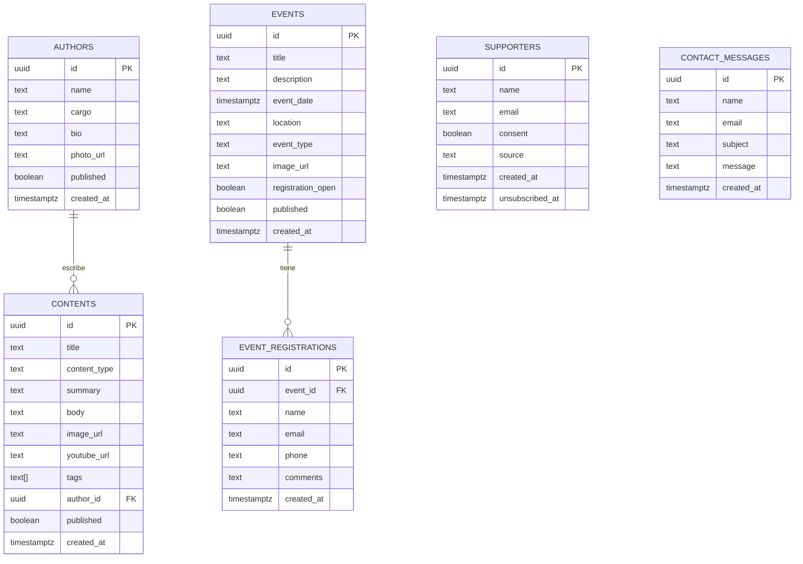

# 🏛️ Somos Hispanidad — Arquitectura de la Plataforma Web

> Documentación técnica completa de la arquitectura, aplicaciones, interrelaciones y flujos de datos del proyecto.

---

## 📁 Estructura de Ficheros del Proyecto

```
SOMOS AG-GH-VL/
├── index.html                     # Página principal pública (multipage)
├── somoshispanidad-landing.html   # Landing alternativa (one-page)
├── supabase-schema.sql            # Esquema de base de datos (fuente de verdad)
├── vercel.json                    # Configuración de despliegue en Vercel
├── package.json                   # Dependencias del proyecto
├── assets/
│   ├── images/                    # Imágenes locales (hero, escorial, etc.)
│   │   ├── favicon-32.png         # Favicon optimizado (32×32px)
│   │   ├── hero-bg.jpg
│   │   ├── monasterio.jpg
│   │   └── ...
│   └── documents/                 # Documentos locales (sin uso activo)
├── src/
│   ├── css/
│   │   └── styles.css             # Hoja de estilos global
│   ├── js/
│   │   ├── supabaseClient.js      # Cliente Supabase + funciones de consulta
│   │   ├── main.js                # Animaciones globales, scroll, navbar
│   │   ├── contenidos.js          # Renderizado de contenidos en web pública
│   │   ├── eventos.js             # Renderizado de eventos en web pública
│   │   └── contacto.js            # Formulario de contacto (Supabase + EmailJS)
│   ├── pages/
│   │   ├── asociacion.html        # Página: La Asociación
│   │   ├── contenidos.html        # Página: Artículos, Vídeos y Conferencias
│   │   ├── eventos.html           # Página: Próximos Eventos
│   │   ├── autores.html           # Página: Autores y Colaboradores
│   │   ├── contacto.html          # Página: Contacto
│   │   └── privacidad.html        # Política de Privacidad
│   └── admin/
│       ├── admin.html             # Panel de control (requiere auth)
│       ├── admin.js               # Lógica del panel (CRUD, marketing, etc.)
│       └── admin.css              # Estilos del panel de control
└── Simpatizantes/
    └── Simpatizantes_Para_Supabase.csv  # Importación inicial de simpatizantes
```

---

## 🌐 Stack Tecnológico

| Capa | Tecnología | Función |
|---|---|---|
| **Frontend** | HTML5 + CSS3 + Vanilla JS | Interfaz pública y panel de control |
| **Base de datos** | Supabase (PostgreSQL) | Almacenamiento de contenidos, eventos, autores, simpatizantes y mensajes |
| **Autenticación** | Supabase Auth | Acceso protegido al panel de control |
| **Almacenamiento de ficheros** | Supabase Storage | PDFs, escritos, actas y barómetro |
| **Email** | EmailJS (`service_sfxfhke`) | Formulario de contacto + campañas de marketing |
| **Despliegue** | Vercel (GitHub CI/CD) | Publicación automática en `somoshispanidad.es` |
| **Tipografías** | Google Fonts | Cormorant Garamond · Cinzel · Lato |

---

## 🗄️ Modelo de Base de Datos (Supabase)



### Seguridad (Row Level Security)
- **Acceso público (anónimo):** SELECT en `contents`, `events`, `authors` donde `published = true`
- **Acceso público (inserción):** INSERT en `event_registrations`, `supporters`, `contact_messages`
- **Acceso admin (autenticado):** ALL (SELECT/INSERT/UPDATE/DELETE) en todas las tablas

---

## 📦 Supabase Storage

| Bucket | Carpeta | Contenido |
|---|---|---|
| `Documentos` | `Escritos/` | PDFs de artículos y escritos de autores |
| `Documentos` | `Barometro-versiones/` | Versiones del Barómetro de la Hispanidad |
| `Documentos` | `Actas/` | Actas de reuniones de la asociación |

> **URL base:** `https://fzftntxrkagnvchhwehn.supabase.co/storage/v1/object/public/Documentos/`

---

## 🔄 Flujos de Datos Principales

### 1. Carga de Contenidos (web pública)
```
index.html
  └─► contenidos.js → getContenidos()
        └─► supabaseClient.js → Supabase DB (contents + authors JOIN)
              └─► Filtra published=true → Renderiza tarjetas con enlace a PDF/YouTube
```

### 2. Carga de Eventos (web pública)
```
index.html / eventos.html
  └─► eventos.js → getEventos()
        └─► supabaseClient.js → Supabase DB (events)
              └─► Filtra published=true + fecha futura → Renderiza tarjetas de evento
```

### 3. Formulario de Contacto
```
index.html → #form-contacto → contacto.js
  ├─► supabaseClient → INSERT en contact_messages
  └─► EmailJS (service_sfxfhke / template_5jjf7vs)
        └─► Email a contacto@somoshispanidad.es
```

### 4. Panel de Control (admin)
```
admin.html → admin.js
  ├─► Supabase Auth → checkAuth() → [login / dashboard]
  ├─► CRUD Contenidos → contents table (+ image_url)
  ├─► CRUD Eventos → events table
  ├─► CRUD Autores → authors table
  ├─► Gestión Simpatizantes → supporters table
  ├─► Mensajes → contact_messages table
  └─► Marketing → EmailJS → envío masivo a supporters
```

### 5. CI/CD (Despliegue)
```
Desarrollador → git push origin main
  └─► GitHub → Vercel (hook automático)
        └─► Build estático → somoshispanidad.es
```

---

## 🔐 Seguridad y Acceso

| Componente | Acceso | Mecanismo |
|---|---|---|
| Panel de control | Solo admin autenticado | Supabase Auth (email + password) |
| Datos públicos | Solo registros con `published=true` | RLS en PostgreSQL |
| Formulario contacto | Público (write-only) | RLS: INSERT permitido a anónimos |
| Storage (PDFs) | Público (lectura) | Bucket configurado como público |
| EmailJS | Solo desde código | Public Key en el frontend |

---

## ⚙️ Variables de Configuración

Todas las claves están en `src/js/supabaseClient.js`:

```javascript
// Supabase
const SUPABASE_URL = 'https://fzftntxrkagnvchhwehn.supabase.co';
const SUPABASE_ANON_KEY = '...';

// EmailJS (en index.html y admin.html)
emailjs.init({ publicKey: '0slY_AJYvHsj932ME' });
// Service ID: service_sfxfhke
// Template ID: template_5jjf7vs
```

---

## 📌 Notas de Mantenimiento

- El archivo `supabase-schema.sql` es la **fuente de verdad** del esquema. Es idempotente: puede re-ejecutarse sin errores.
- Al añadir nuevas tablas o columnas, hacerlo siempre en `supabase-schema.sql` con `IF NOT EXISTS`.
- El campo `published` controla la visibilidad pública en `contents`, `events` y `authors`.
- El plan gratuito de Supabase incluye **1 GB Storage** y **500 MB DB**. Supervisar uso periódicamente.
- El plan gratuito de EmailJS permite **200 emails/mes**. Para campañas masivas, verificar el límite.
